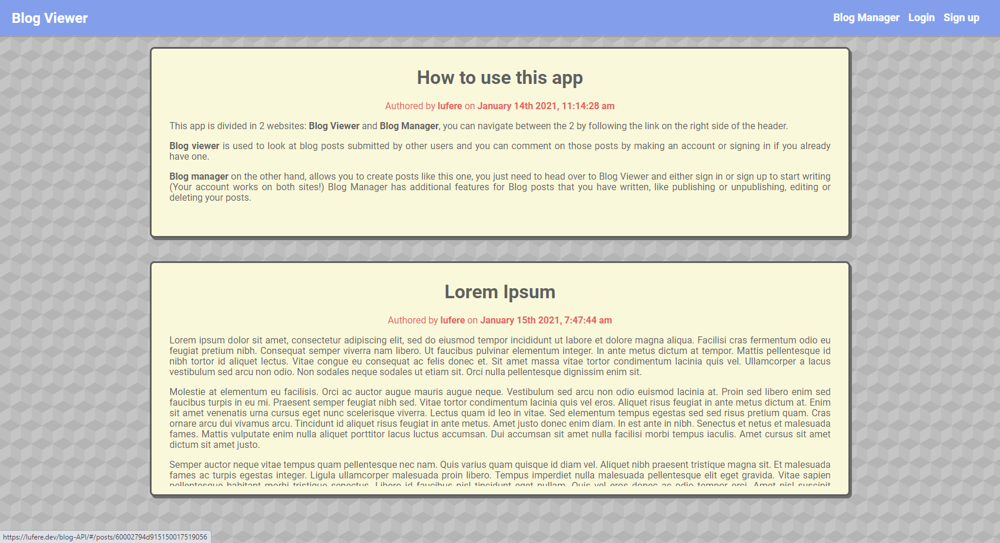

# Blog API

Full Stack application for the creation and handling of blog posts.

## Backend
The backend consists of a **REST API** with and **MVC Architecture** built on **NodeJS** to submit posts and comments to a **MongoDB** database.

The app has token based user authorization handled by **JSON Web Tokens** and **PassportJS**

## Frontend

The frontend involves 2 separate React clients, **Blog Viewer** and **Blog Manager**. Blog Viewer is found on this repository, while Blog Manager's source code can be found on its [own separate repository.](https://github.com/lufere/blog-manager)

**Blog Viewer** is the client which allows users to see blog posts made by all users, whether they are logged in or not. Users can make comments on blog posts if they have an account and are logged in. Built with **functional components** with the help of **React Hooks** for state management and lifecycle methods. Navigation is handled by **React Router**.